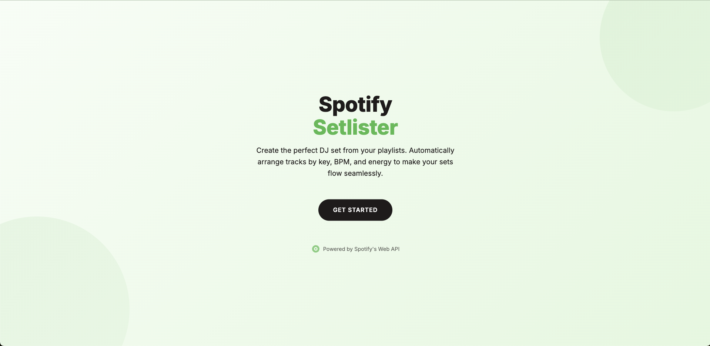
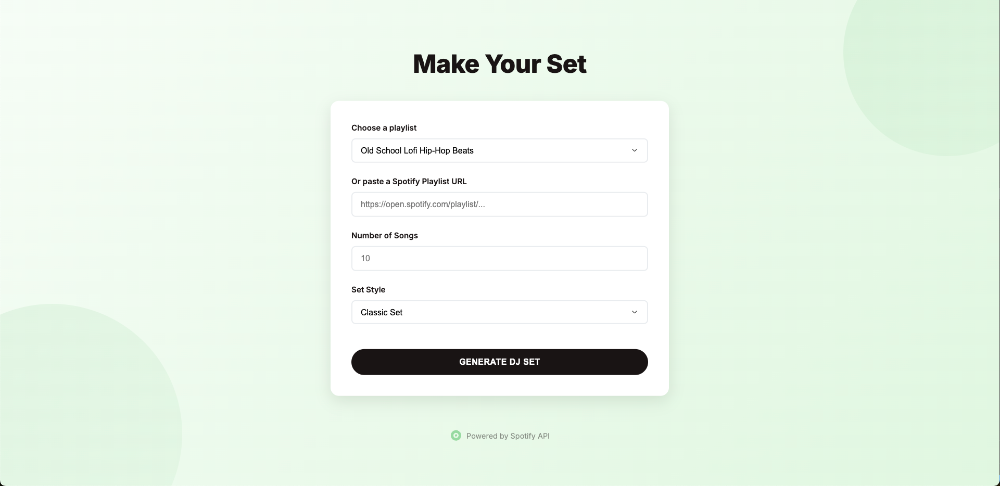

# DJ Set Generator Web App 🎵

## Overview
The **DJ Set Generator Web App** is a web application that allows users to create optimized DJ setlists from their Spotify playlists. Users log in via Spotify, select a playlist, and specify the number of tracks and style of the set. The app processes the playlist using machine learning-based optimization and generates an ideal DJ set.

The app is hosted on **AWS EC2**, uses **Flask** for the backend, and **Spotipy** for Spotify API integration.

## ⚡ Demo in Action


> **What's happening here?** The demo showcases two different algorithmic approaches to playlist generation:
> 1. A **Classic Set** optimizing for tonal compatibility and consistent high energy, perfect for tech house and similar genres where maintaining the groove is crucial
> 2. A **Riser Set** that intelligently builds energy throughout the sequence, using Spotify's audio features (energy, danceability) to create a gradually intensifying experience, while maintaining a reasonable level of tonal compatibility
>
> Both algorithms analyze track compatibility and extract audio features via Spotify's Web API, but each serves a distinct purpose in the art of setlist curation. 🎛️

## Screenshots



## Features
- 🎧 **Spotify Login**: Users authenticate via Spotify OAuth.
- 📜 **Playlist Selection**: Fetches and displays the user's Spotify playlists.
- 🔍 **Custom Set Generation**: Generates a DJ set based on playlist tracks.
- 🎼 **Set Optimization**: ML-based optimization for transitions, energy, and key compatibility.
- 🎵 **Playlist Creation**: Automatically creates the set as a new playlist in Spotify.
- 🌐 **Deployed on AWS EC2**.

## Tech Stack
| Component       | Technology Used |
|----------------|----------------|
| **Frontend**   | HTML, CSS, JavaScript |
| **Backend**    | Flask (Python) |
| **Database**   | N/A (Uses Spotify API) |
| **Auth**       | Spotify OAuth |
| **ML/Optimization** | Genetic Algorithm for DJ set optimization |
| **Deployment** | AWS EC2 |

## Installation & Setup
### 1️⃣ Clone the repository


```bash
git clone https://github.com/yourusername/dj-set-generator.git
cd dj-set-generator
```

### 2️⃣ Set up a virtual environment
python3 -m venv venv
source venv/bin/activate  # On Windows use: venv\Scripts\activate


### 3️⃣ Install dependencies
pip install -r requirements.txt

### 4️⃣ Set up the .env file
Create a .env file in the project root and add your Spotify API credentials:
SPOTIPY_CLIENT_ID=your_spotify_client_id
SPOTIPY_CLIENT_SECRET=your_spotify_client_secret
SPOTIPY_REDIRECT_URI=http://127.0.0.1:5000/callback
FLASK_SECRET_KEY=your-key
FLASK_DEBUG=True

5️⃣ Run the app
flask run
Then, open http://127.0.0.1:5000/ in your browser.

# Usage
1. Click "Get Started" to log in via Spotify.
2. Select a playlist or paste a Spotify playlist link.
3. Choose the number of tracks and set style.
4. Click "Generate DJ Set" to create your optimized setlist.
5. View the generated playlist or click the Spotify link to listen.

# Deployment on AWS EC2
This app is deployed on an AWS EC2 instance using:
- Ubuntu Server
- Flask
- Gunicorn (optional)
- Nginx (optional for production)

  
#### To deploy:
scp -i your-key.pem -r * ec2-user@your-ec2-ip:/home/ec2-user/dj-set-generator
ssh -i your-key.pem ec2-user@your-ec2-ip

#### Then run:
flask run --host=0.0.0.0
Access via http://your-ec2-ip:5000.

## Issues & Debugging
Login Loop? → Clear cache & delete .cache-* files.
Invalid Redirect URI? → Ensure the URI in Spotify Developer Dashboard matches http://127.0.0.1:5000/callback.
Playlists Not Showing? → Ensure correct Spotify OAuth Scopes are used.

## Future Improvements
🎭 Mobile UI Optimization
🤖 AI-based Playlist Mixing
🚀 Docker Deployment
🔄 Better Caching for Token Handling

## License
MIT License. Free to use & modify.


